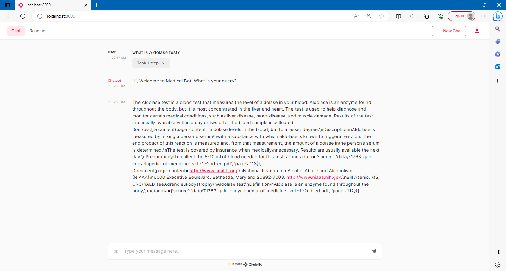

# Knowledge-Base-Question-Answering-Chatbot
This is a medical chatbot built using Llama2 and Sentence Transformers for multiple Large PDF files (You can change to any other field PDF files). The chatbot is designed to deliver a seamless conversational experience with its natural language processing capabilities on your own data.

The chatbot is powered by Langchain, Fasiss and Chainlit. LangChain is a framework that makes it easier to build scalable AI/LLM apps and chatbots. Faiss is a vectorstore for storing embeddings and your PDF in text to later retrieve similar docs. Chainlit lets you create ChatGPT-like UIs on top of any Python code. 

The chatbot runs on a decent CPU machine with a minimum of 16GB of RAM.

### Prerequisites

- Python 3.9.17

- Download `llama-2-7b-chat.ggmlv3.q8_0.bin` model to local reop folder: 
  - https://huggingface.co/TheBloke/Llama-2-7B-Chat-GGML/blob/main/llama-2-7b-chat.ggmlv3.q8_0.bin

## Install package

`pip install -r requirements.txt`

## Run

### Convert your PDFs to embeddings

1. Put your PDF doc under `/data` folder
2. Run the script `python ingest.py` to 'ingest' and embed your docs. 
3. Verify that the `index.pkl` and `index.faiss` files are successfully created in the `/vectorstore/db_faiss` folder.

### Run the app

Once you've verified that the embeddings and content have been successfully added to your faiss store, you can run the app `chainlit run model.py -w` to launch the local dev environment with Chainlit UI, and then type a question in the chat interface.

## Credit: 

- [AIAnytime](https://github.com/AIAnytime/Llama2-Medical-Chatbot)
- [Chainlit](https://github.com/Chainlit/chainlit)
